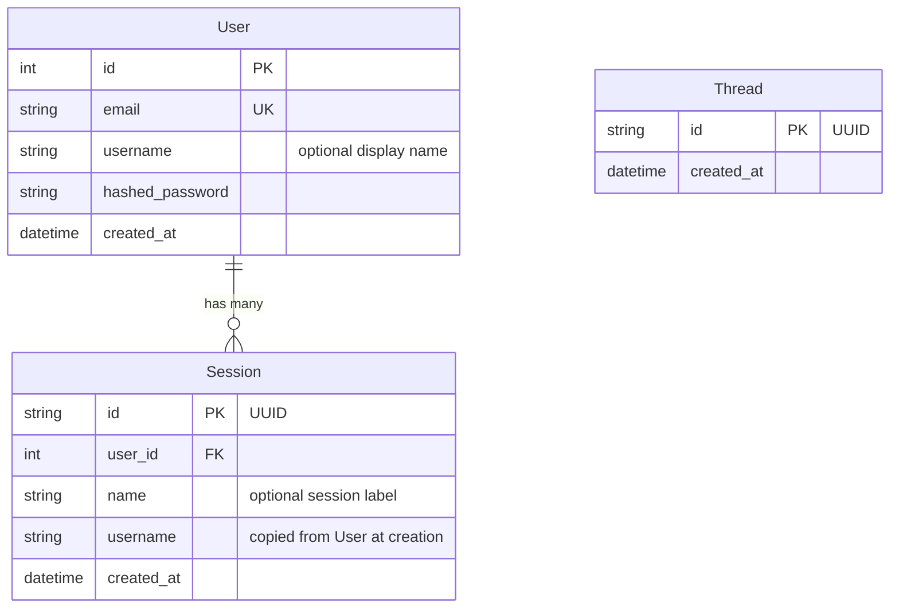

# Database & Migrations

## Schema



**User** — one per account. Email is unique. `username` is optional and used to personalise the system prompt.

**Session** — one per conversation. A user can have many sessions. `username` is denormalised from `User` at creation time so chat requests never need an extra DB lookup. The session JWT scopes all chat requests.

**Thread** — mirrors LangGraph's `AsyncPostgresSaver` checkpoint thread. Tracks which threads exist in the app's context.

The LangGraph checkpointer also creates its own tables (`checkpoints`, `checkpoint_blobs`, `checkpoint_writes`) — these are managed by LangGraph itself, not by Alembic.

pgvector creates a `longterm_memory` collection table managed by mem0 — also not by Alembic.

---

## Database backends (PostgreSQL / MySQL)

The relational layer is dialect-aware. `DB_DIALECT` selects the backend, and a
small factory layer (`src/agent/core/db/`) resolves the right driver,
LangGraph checkpointer, and vector store. **Switching one config value swaps all
three layers** — no business code changes.

| Layer | `postgres` (default) | `mysql` |
|-------|----------------------|---------|
| Relational (User/Session/Thread) | psycopg2 / psycopg | asyncmy / pymysql |
| LangGraph checkpointer | `AsyncPostgresSaver` | `AIOMySQLSaver` |
| Long-term memory vector store | pgvector (same DB) | Weaviate (standalone) |

### Configuration

Settings are read as generalized `DB_*` keys, falling back to the legacy
`POSTGRES_*` names so **existing PostgreSQL deployments need no changes**:

```bash
DB_DIALECT=postgres            # or "mysql"
DB_HOST / DB_PORT / DB_NAME / DB_USER / DB_PASSWORD
DB_POOL_SIZE / DB_MAX_OVERFLOW
VECTOR_STORE_PROVIDER=pgvector # auto-defaults to "weaviate" when DB_DIALECT=mysql
WEAVIATE_CLUSTER_URL / WEAVIATE_API_KEY
```

Defaults derive from the dialect: port `5432`/`3306`, and vector provider
`pgvector`/`weaviate`. See `.env.example` (postgres) and `.env.mysql.example`
(mysql + Weaviate).

### Running on MySQL

```bash
uv sync --extra mysql                      # asyncmy, pymysql, langgraph-checkpoint-mysql, weaviate-client
COMPOSE_PROFILES=mysql make stack-up       # starts mysql + weaviate (see docker-compose.yml)
make migrate                               # alembic creates the relational tables on MySQL 8+
```

> MySQL **8+** is required (the checkpointer relies on MySQL 8 features). The app
> forces `charset=utf8mb4` on every MySQL connection (both the SQLAlchemy engine
> and the aiomysql checkpointer pool), and tables use MySQL 8's default
> `utf8mb4_0900_ai_ci` collation — keep the server on that default (do **not**
> override `collation-server` to `utf8mb4_unicode_ci`, or checkpointer queries
> raise "illegal mix of collations"). `User.email`'s unique index fits within
> MySQL's index limit at `VARCHAR(255)`. Long-term memory does **not** migrate
> between pgvector and Weaviate — switching the vector store starts memory fresh.

The full design rationale is in [multi-database-design.md](../.venv/multi-database-design.md).

---

## Migrations with Alembic

All schema changes are managed through Alembic. The app no longer calls `create_all()` on startup — Alembic owns the schema.

### Initial setup (fresh database)

```bash
make migrate              # applies all migrations to the database
```

### Creating a migration after model changes

```bash
# 1. Edit your SQLModel model (src/agent/models/)
# 2. Generate the migration
make migration MSG="add phone number to user"

# 3. Review the generated file in alembic/versions/
# 4. Apply it
make migrate
```

### Other commands

```bash
make migrate-downgrade    # roll back the last migration
make migrate-history      # show the full migration history
```

Alembic reads DB credentials from your `.env` file (via `src/agent/core/config.py`). Make sure the correct `APP_ENV` is set before running migrations.

### How autogenerate works

`env.py` imports all SQLModel models so their metadata is registered, then calls `alembic revision --autogenerate`. Alembic diffs the current DB schema against the models and generates the upgrade/downgrade functions.

External tables (LangGraph checkpointer, mem0, pgvector) are excluded via `include_object` in `alembic/env.py` so Alembic never touches them.

### Adding a new model

1. Create `src/agent/models/your_model.py`
2. Import it in `alembic/env.py` alongside the other model imports
3. Run `make migration MSG="add your_model table"`

---

## Adding pgvector to a fresh database

pgvector must be enabled before running migrations:

```sql
CREATE EXTENSION IF NOT EXISTS vector;
```

With Docker (`make docker-up`), this is handled automatically by the `db` service. For external databases (e.g. Supabase), enable the extension via the dashboard or SQL editor.
