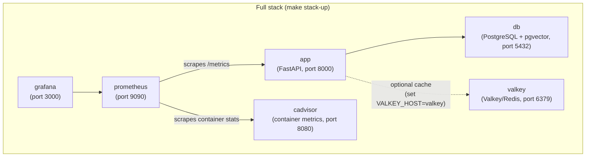

# Docker

## Services



Valkey is always started but only used by the app when `VALKEY_HOST=valkey` is set in your `.env` file. Without it the app falls back to an in-memory cache.

### MySQL + Weaviate backend (opt-in)

The default stack uses PostgreSQL + pgvector. To run on MySQL instead, the
`mysql` and `weaviate` services are gated behind the `mysql` compose profile:

```bash
COMPOSE_PROFILES=mysql make stack-up ENV=development
```

Set `DB_DIALECT=mysql` in your env file (see `.env.mysql.example`). The `mysql`
service (port 3306) replaces `db`, and `weaviate` (port 8080) provides the
long-term-memory vector store. Without the profile these services are not
created, so existing PostgreSQL workflows are unchanged. See
[database.md](database.md#database-backends-postgresql--mysql) for details.

## Commands

### API + database only (most common for development)

```bash
make docker-up ENV=development     # start
make docker-down ENV=development   # stop
make docker-logs ENV=development   # tail logs
```

### Full stack (includes Prometheus + Grafana)

```bash
make stack-up ENV=development      # start everything
make stack-down ENV=development    # stop everything
make stack-logs ENV=development    # tail all service logs
```

### Build a custom image

```bash
make docker-build ENV=production
```

This runs `scripts/build-docker.sh` which builds and tags the image for the specified environment.

## Running migrations inside Docker

After `make docker-up`, run migrations against the containerised database:

```bash
make migrate ENV=development
```

This sources the correct `.env` file and runs `alembic upgrade head` from your local machine, connecting to the containerised PostgreSQL.

## Environment files

Each environment needs a `.env.<env>` file:

```bash
cp .env.example .env.development
cp .env.example .env.staging
cp .env.example .env.production
```

The `docker-up` and `stack-up` commands pass the env file to Docker Compose via `--env-file`. Make sure the DB host matches the Compose service name (not `localhost`): `POSTGRES_HOST=db` for PostgreSQL, or `DB_HOST=mysql` for the MySQL profile.

## API smoke test

`scripts/smoke_test_api.py` exercises the DB-backed endpoints end to end against
a running server, so it validates either backend (PostgreSQL or MySQL). It has
no third-party dependencies.

```bash
# with the app running on :8000
python scripts/smoke_test_api.py

# custom host / include the chat endpoint (needs a working LLM key)
BASE_URL=http://localhost:8000 RUN_CHAT=1 python scripts/smoke_test_api.py
```

It runs: health → register → login → create session → list sessions → rename →
get messages → clear history (checkpointer delete) → delete session, printing a
pass/fail line per step and exiting non-zero on any failure. The chat step is
skipped unless `RUN_CHAT=1`.

## Grafana

After `make stack-up`, Grafana is available at [http://localhost:3000](http://localhost:3000).

Default credentials: `admin` / `admin`

Pre-configured dashboards (in `grafana/`):

- API performance (request rate, latency, error rate)
- Rate limiting statistics
- Database connection pool health
- System resource usage
