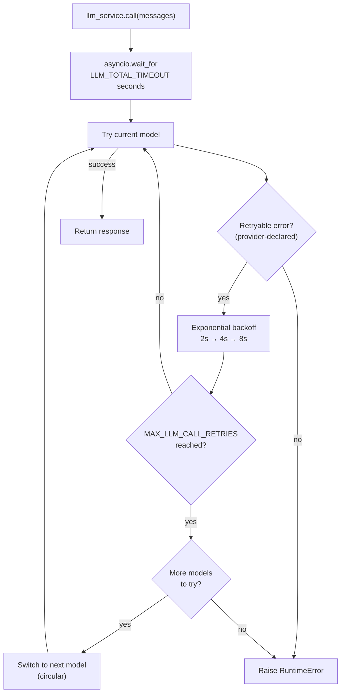

# LLM Service

## Overview

The LLM service (`src/agent/services/llm/`) handles all language model calls with automatic retries, circular model fallback, and a total timeout budget. Your agent code calls `llm_service.call(messages)` — the service handles everything else.

The package is split into:

- `src/agent/services/llm/providers/` — provider adapters (`openai`, `anthropic`, …) behind a `build_chat_model()` factory; each adapter declares how to build its `BaseChatModel` and which errors are transient vs fatal
- `src/agent/services/llm/registry.py` — `LLMRegistry`: the active model list, built from config
- `src/agent/services/llm/service.py` — `LLMService`: call logic, retries, fallback, structured output

## Providers

The backend is selected by `LLM_PROVIDER` (default `openai`). The whole graph is built on LangChain's `BaseChatModel`, so switching providers is config-only.

| `LLM_PROVIDER` | Adapter | Credentials | Install |
|---|---|---|---|
| `openai` | `providers/openai.py` (`ChatOpenAI`) | `OPENAI_API_KEY` (+ optional `OPENAI_BASE_URL` for compatible endpoints) | built-in |
| `anthropic` | `providers/anthropic.py` (`ChatAnthropic`) | `ANTHROPIC_API_KEY` | `uv sync --extra anthropic` |

**Adding a provider** — create `providers/<name>.py` with an `LLMProvider` subclass implementing `build()` and declaring `retryable_errors` / `fatal_errors`, then register it in `providers/__init__.py`. No other code changes.

## Model registry

The model list is **config-driven** — no model names are hardcoded:

- `DEFAULT_LLM_MODEL` — the primary model.
- `LLM_FALLBACK_MODELS` — optional comma-separated fallbacks, tried in order.

Together these form `settings.llm.model_chain` (deduplicated), which `LLMRegistry` builds via the active provider's adapter. To change models, edit your `.env` — no code edits needed.

## Retry and fallback behaviour



**Retry config** (per model):

- Max attempts: `MAX_LLM_CALL_RETRIES` (default: 3)
- Wait: exponential backoff, 2s min, 10s max
- Retries on: the **active provider's** `retryable_errors` (e.g. OpenAI's `RateLimitError`/`APITimeoutError`/`APIError`, Anthropic's equivalents). The service never references a specific SDK's exceptions directly.

**Total timeout**: `LLM_TOTAL_TIMEOUT` seconds (default: 60s) caps the entire loop.

**Fallback order**: circular through `settings.llm.model_chain`. A model is treated as exhausted when it raises one of the provider's `fatal_errors`; the loop then advances to the next model and stops after one full cycle.

## Tools

Tools are bound to the LLM at startup and re-bound automatically when a model is switched during fallback:

```python
llm_service.bind_tools(tools)
```

## Structured output

Pass a Pydantic model as `response_format` to get a validated instance back instead of a raw `BaseMessage` (works across providers via `.with_structured_output`):

```python
from agent.schemas.my_schema import MySchema

result: MySchema = await llm_service.call(
    messages,
    model_name=settings.llm.model,   # optional — omit to use the current default
    response_format=MySchema,
    temperature=0.2,
)
```

A `model_name` that isn't in the configured chain is built on the fly for a single call (no cross-model fallback) — useful for a dedicated session-naming model (`SESSION_NAMING_MODEL`).
